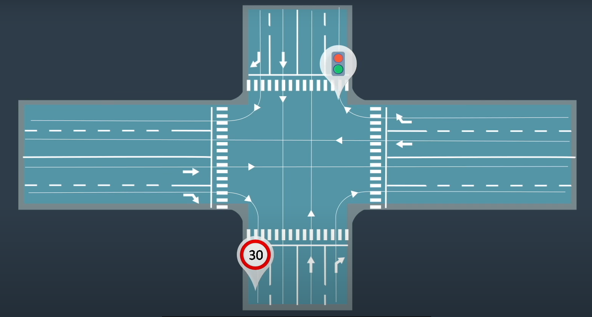
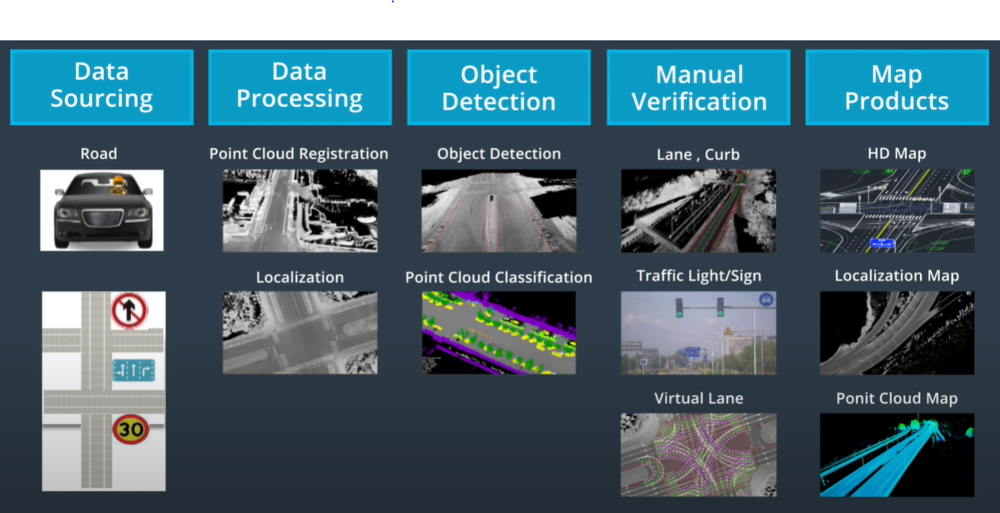

This is my note for lesson 2 of MOOC course: Self-Driving Fundamentals - Featuring Apollo. Content: High Definition maps for self driving cars.

HD Maps have a high precision and contain a lot of information than your ordinary map on smartphone, such as lane line markings, 3D representation of the road network, traffic signs... You can what you see and GPS to locate your self in the world and identify other objects. However, it's very difficult with a self driving car, so we need HD Maps for current SDCs.

## Precision

- Navigation map on your phone: meter-level precision
- HD Maps: centimeter-level precision

## Localization on HD Maps

Self-driving car uses sensor and camera signals to recognize where it is on HD Map.

## Standard

- Apollo uses OpenDRIVE map format, and improve it to become Apollo OpenDRIVE standard.

## Map construction

- Steps for map production:

