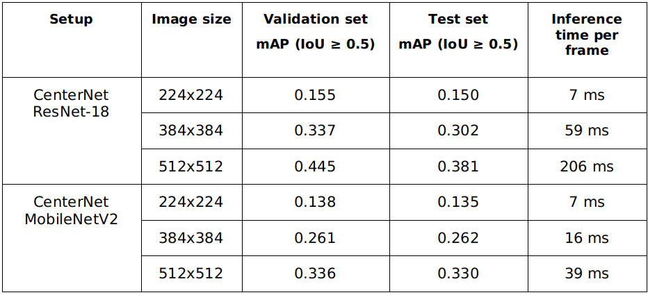
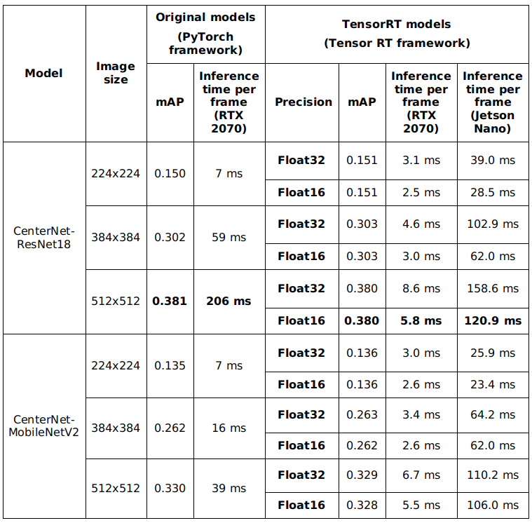
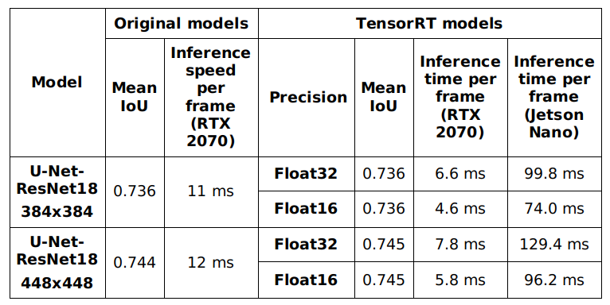

Recently, I have built a prototype of an advanced driver-assistance system (ADAS) using a [Jetson Nano computer](/posts/2020-04-02-thiet-lap-ban-dau-cho-jetson-nano/). In this project, I have successfully deployed **3 deep neural networks**  and some **computer vision algorithms** on a [super cheap hardware of Jetson Nano](https://www.nvidia.com/en-us/autonomous-machines/jetson-store/). In the last two posts, I have introduced the system in [hardware](https://aicurious.io/posts/adas-jetson-nano-intro-and-hardware/) and [software](https://aicurious.io/posts/adas-jetson-nano-software/) design. In this week, I write about two machine learning modules: **Object Detection Module** and **Lane Detection Module**. I will focus on three core deep neural networks: an object detection network based on CenterNet, a ResNet-18 based traffic sign classification network and a U-Net based lane line segmentation network. I also introduce some experimental results in training and optimizing these networks.

## I. Object Detection Module

Based on hardware constraints described in [the first post of this series](/posts/adas-jetson-nano-intro-and-hardware/), in this section, I will introduce one of the key modules in machine learning block - Object Detection Module. This module is responsible for detect front obstacle objects such as other vehicles or pedestrians, and traffic signs. These results can be used for forward collision warning and over-speed warning. To provide these functions, the module contains two main components: a CenterNet based object detection neural network and a ResNet-18 based traffic sign classification network.

### 1. CenterNet-based Object detection network

Traffic object detection is a key deep neural network which contributes in forward collision warning and overspeed warning functions in my system.

#### Background

Recently, a trend in object detection improvement is to treat object detection as key point estimation problem. [CenterNet Objects as Points](https://arxiv.org/abs/1904.07850) introduced in 2019 uses keypoint estimation to find object center points and regresses to all other object properties, such as size, 3D location, orientation, and even pose. The simplicity of this method allows CenterNet to run at a very high speed and outperform a range of state-of-the-art algorithms. In this object detection module, I choose CenterNet as the main object detection network because its simplicity and efficiency make it suitable for embedded hardware. I trained CenterNet using Berkeley DeepDrive (BDD) dataset with 10 classes: `person`, `rider`, `car`, `bus`, `truck`, `bike`, `motor`, `traffic light`, `traffic sign` and `train`. I have a blog post about CenterNet [here](https://aicurious.io/posts/2020-04-23-tim-hieu-ve-centernet/) (It's only available in Vietnamese).

#### Backbones

In this project, I use [MobileNetV2](https://arxiv.org/abs/1801.04381) and [ResNet-18](https://arxiv.org/abs/1512.03385) as the backbone of CenterNet.

Nowadays, state-of-the-art CNN architectures go deeper and deeper. While AlexNet had solely 5 convolutional layers, the VGG  network and GoogleNet had 19 and 22 layers respectively. However, increasing network depth does not work by merely stacking layers along. Deep networks are hard to train because of the vanishing gradient problem - as the gradient is back-propagated to earlier layers, repeated multiplication may make the gradient become very small. As a result, once the network goes deeper, its performance gets saturated or begins to degrade quickly. The core idea of ResNet solution is introducing an “identity shortcut connection” that skips one or more layers. Following is the image of how to construct an “identity shortcut connection”.  Instead of learning a direct mapping of $x \rightarrow y$ with a function $H(x)$, let us define the residual function using $F(x) = H(x) - x$, which can be reframed into $H(x) = F(x) + x$, where $F(x)$ and $x$ represents the stacked non-linear layers and the identity function respectively. The author’s hypothesis is that it is easy to optimize the residual mapping function $F(x)$ than to optimize the original, unreferenced mapping $H(x)$. By this way, they can construct networks with much more layers. ResNet-18 is a lightweight 18-layer network with residual blocks.

***MobileNetV2*** is a lightweight architecture targeting in mobile and embedded devices. This network also uses residual architecture like ResNet. Moreover, depth-wise separable convolution is used which dramatically reduce the complexity cost and model size of the network.

#### Dataset

[BDD100K](https://bdd-data.berkeley.edu/) is used as the main dataset for object detection. In the original download website, authors divided their dataset into three subsets: training, validation, and test, which I will call original training set, original validation set, and original test set, respectively.  I could not download the original test set because it was not available during my project schedule, so I only use original training and original validation sets of this dataset.
BDD100K original validation set is setup up as test set in my experiments. Besides, I randomly split original training set into training set and validation set with ratio 85:15 for my experiments. Below is the distribution of the datasets used in this project.

**Table: Object detection test set: 10000 images (~12.5% number of images in the whole dataset)**

| **Class**            | **person** | **rider** | **car** | **bus** | **truck** | **bike** | **motor** | **traffic light** | **traffic sign** | **train** |
| -------------------- | ---------- | --------- | ------- | ------- | --------- | -------- | --------- | ----------------- | ---------------- | --------- |
| **Number of images** | 13262      | 649       | 102506  | 1597    | 4245      | 1007     | 452       | 26885             | 34908            | 15        |

**Table: Object detection training set: 59383 images (~74% number of images in the whole dataset)**

| **Class**            | **person** | **rider** | **car** | **bus** | **truck** | **bike** | **motor** | **traffic light** | **traffic sign** | **train** |
| -------------------- | ---------- | --------- | ------- | ------- | --------- | -------- | --------- | ----------------- | ---------------- | --------- |
| **Number of images** | 77637      | 3853      | 605279  | 9950    | 25493     | 6157     | 2576      | 157491            | 203297           | 119       |

**Table: Object detection validation set: 10480 images (~13.5% number of images in the whole dataset)**

| **Class**            | **person** | **rider** | **car** | **bus** | **truck** | **bike** | **motor** | **traffic light** | **traffic sign** | **train** |
| -------------------- | ---------- | --------- | ------- | ------- | --------- | -------- | --------- | ----------------- | ---------------- | --------- |
| **Number of images** | 13712      | 664       | 107932  | 1722    | 25493     | 1053     | 426       | 28626             | 36389            | 17        |

All datasets are converted into [COCO](http://cocodataset.org/)-like object detection format. 

#### Experiments

ResNet-18 and MobileNetV2 are two lightweight backbones which are used in my experiments. For training, I use the source code from CenterNet’s authors with some modifications:

- ResNet-18 backbone was implemented in the original source code from CenterNet’s authors. This source code was written with PyTorch framework. I trained this network with three image sizes 224x224, 384x384, 512x512 and batch size 32. Learning rate is set to $10^{-4}$, reduced to $10^{-5}$ on epoch 90, $10^{-6}$ on epoch 120.  These setups were trained in 140 epochs.
- Besides ResNet-18, MobileNetV2 backbone was added into the original source code. I trained this network with three image sizes 224x224, 384x384, 512x512 and batch size 32. Learning rate is set to $5x10^{-4}$,  reduced to $5x10^{-5}$ on epoch 35. These setups were trained in 70 epochs.

**Result**

The mean average precision and the inference speed of trained models are described in below table (system configuration: Intel Core i5 8400 and NVIDIA RTX 2070). As shown in the table, the inference time of CenterNet – MobileNet V2 models are lower than CenterNet – ResNet-18 models. However, these models are also less accurate than CenterNet – ResNet-18 models.

**Table: Mean average accuracy and inference time of CenterNet models. mAP: mean average precision, IoU: intersection over union.**

#### Model optimization for embedded hardware

After training CenterNet using PyTorch framework, we obtain model files in PyTorch model format (.pth). In order to optimize inference speed on NVIDIA Jetson Nano, we need to convert these models to TensorRT engine file. The conversion is done via an intermediate format called ONNX ([Open Neural Network Exchange](https://onnx.ai/)). PyTorch model is converted to ONNX format first using PyTorch ONNX module (step 1). After that, we convert ONNX model to TensorRT engine for each inference platform (step 2). Because the conversion from ONNX to TensorRT engine takes a long time, in my implementation, I serialize TensorRT engine to hard disk after converting and load it every time the program starts. In this step, we have to notice that TensorRT engine is built differently on different computer hardware. Therefore, we need to rebuild the engine if we need to inference on other hardware configuration.

After the engine conversion, I test the result on the test set. The accuracy and inference time of the models are described in following table. The inference time of CenterNet – MobileNet V2 models are lower than CenterNet – ResNet-18 models. However, these models are also less accurate than CenterNet – ResNet-18 models. The accuracy difference between the original models and the converted models is negligible. The difference in accuracy between float 16 and float 32 precision is also small (mAP columns). However, the efficiency of the conversion process can be clearly seen (comparing the inference time of models for the original PyTorch framework and the converted models).

**Table: Accuracy and inference time comparison after TensorRT engine conversion – Object detection model. The evaluation is done on the test set**

Based on the evaluation result, we can see that CenterNet with two lightweight backbones ResNet-18 and MobileNetV2 can achieve an acceptable accuracy and relatively high inference speed. The speed of these networks can be pushed further by running in float 16 precision without a noticeable reduction in accuracy. ResNet-18 backbone can be optimized better than MobileNetV2 in term of speed, which can be recognized by a larger reduction in inference time after converting. As CenterNet model with ResNet-18 backbone and input image size 384x384 provides the best balance between speed and accuracy on Jetson Nano, it is chosen as the main architecture for this project.

### 2. Traffic sign classification network

Due to the limitation of BDD dataset - It's only contains 1 class for traffic signs (without specifying the sign type), I had to train another neural network to recognize sign types. Because of the high speed and accuracy, ResNet-18 was also chosen for this task. I trained the model using Tensorflow and Keras frameworks. However, to optimize the speed, I also convert final model to TensorRT format.

#### Dataset

In this project, I only design the system to classify maximum speed signs, and I treat each speed level as a separate object class. In order to collect enough data for training, I use 2 datasets: [Mapillary Traffic Sign Dataset (MTSD)](https://www.mapillary.com/dataset/trafficsign) and [German Traffic Sign Recognition (GRSRB)](http://benchmark.ini.rub.de/?section=gtsrb&subsection=news) dataset. As MTSD is a traffic sign detection dataset, I use sign bounding boxes to crop them for classification task. After cropping, I merge 2 datasets and have 18,581 images of maximum speed limit traffic signs divided into 13 classes, and 879 end of speed limit signs (treating all end of speed limit signs as only 1 class). Besides, I use 20,000 crop images from other traffic signs and objects for “unknown” class. In total, there are 15 classes in this dataset: maximum speed signs (5km/h, 10km/h, 20km/h, 30km/h, 40km/h, 50km/h, 60km/h, 70km/h, 80km/h, 90km/h, 100km/h, 110km/h, 120km/h), end of speed limit (EOSL) and other sign (OTHER). After that, this dataset is divided into 3 subsets: training set (80%), validation set (10%) and test set (10%). The distribution is randomly for each traffic sign class. The final result is described in following tables.

**Table: Number of images for each traffic sign class in training set. SL_X: maximum speed limit X km/h. EOSL: End of speed limit. OTHER: other objects – unknown class**

| **SL5** | **SL10** | **SL20** | **SL30** | **SL40** | **SL50** | **SL60** | **SL70** | **SL80** | **SL90** | **SL100** | **SL110** | **SL120** | **EOSL** | **OTHER** |
| ------- | -------- | -------- | -------- | -------- | -------- | -------- | -------- | -------- | -------- | --------- | --------- | --------- | -------- | --------- |
| 192     | 377      | 632      | 2312     | 1328     | 2164     | 1677     | 1677     | 1662     | 517      | 1105      | 251       | 989       | 700      | 16000     |

**Table: Number of images for each traffic sign class in validation set. SL_X: maximum speed limit X km/h. EOSL: End of speed limit. OTHER: other objects – unknown class**

| **SL5** | **SL10** | **SL20** | **SL30** | **SL40** | **SL50** | **SL60** | **SL70** | **SL80** | **SL90** | **SL100** | **SL110** | **SL120** | **EOSL** | **OTHER** |
| ------- | -------- | -------- | -------- | -------- | -------- | -------- | -------- | -------- | -------- | --------- | --------- | --------- | -------- | --------- |
| 23      | 46       | 79       | 288      | 166      | 270      | 209      | 209      | 207      | 64       | 138       | 31        | 123       | 87       | 2000      |

**Table: Number of images for each traffic sign class in test set. SL_X: maximum speed limit X km/h. EOSL: End of speed limit. OTHER: other objects – unknown class**

| **SL5** | **SL10** | **SL20** | **SL30** | **SL40** | **SL50** | **SL60** | **SL70** | **SL80** | **SL90** | **SL100** | **SL110** | **SL120** | **EOSL** | **OTHER** |
| ------- | -------- | -------- | -------- | -------- | -------- | -------- | -------- | -------- | -------- | --------- | --------- | --------- | -------- | --------- |
| 23      | 46       | 79       | 288      | 166      | 270      | 209      | 209      | 207      | 64       | 138       | 31        | 123       | 87       | 2000      |

#### Experiments

I trained traffic sign classification network with image size 64x64, Adam optimizer with learning rate 0.0001, batch size 32, loss function categorical cross entropy. In order to deal with class imbalance problem, I set loss weight for class OTHER to **0.001** and for other classes to **1.0**. This setup was trained in 45 epochs and I consider the lowest validation loss model at epoch 39 as the best model. My best model achieves micro **F1 = 0.984** on the test set.

#### Model optimization for embedded hardware

The optimization from trained Keras model to TensorRT engine goes through 3 steps: freeze model from Keras model format to Tensorflow frozen graph, convert from frozen model to [UFF (Universal Framework Format)](https://docs.nvidia.com/deeplearning/tensorrt/api/python_api/uff/uff.html) and finally to TensorRT engine. UFF is recommended by NVIDIA as an immediate model format to convert deep learning models for TensorRT framework. The conversion is demonstrated in following figure.

After testing TensorRT models, float 32 and float 16 precision model achieves F1 metric equal to **0.9843** and **0.9840** respectively on the test set. There is a small difference between these models and original Keras model (**F1 = 0.9843**). The speed is also improved in comparison with the original Keras model. The detail results are described in following table.

**Table: Accuracy and inference time comparison after TensorRT engine conversion – Traffic sign classification model. The evaluation was done on the test set**

**Discussion**

The final traffic sign classification model has a high accuracy **(mAP ~0.98)**, which is enough for production. This network is also fast: it can run at **1.9 ms** per frame NVIDIA RTX 2070 and **6.6 ms** per frame on Jetson Nano. TensorRT float 16 model was integrated in our system.

## II. Lane Detection Module

Lane line detection module takes responsibility to detect lane lines and lane departure situation. This result is then used for lane departure warning. In this section, I describe the solution for lane line detection using deep neural network and Hough transform line detector.

Traditional lane detection algorithms rely on highly specialized, handcrafted features to segment lane lines and fit lines using Hough transform or B-Snake-based algorithm. Popular representatives of this algorithm type use color-based features in combination with Hough transform, Canny edge detection algorithm in combination with Hough transform, ridgeness feature and RANSAC algorithm. In general, these traditional approaches are prone to robustness issues due to road scene variations (time of the day, weather condition, faded lane lines), and only performs well in some specific situations. Currently, the evolution of deep learning algorithms provides us better tools to build robust lane detection algorithms. U-Net is a fully convolutional network that works well in biomedical image segmentation, it can demonstrate high-precision segmentation results with less training image data. I applied U-Net to lane line segmentation problem and combined with Hough transform to find lane lines in form of line equations. 

The main principle of this module can be described in following figure. From RGB image captured using car dash cam, the system uses a U-Net based lane line segmentation neural network to output a binary image, in which, pixels corresponding to lane lines is in white. From this binary image, the system uses Hough line transform to detect lines in the image and group them into lane lines using spatial information. After that, we can find left and right lane lines in the third step and determine lane departure situation.

### 1. Lane line segmentation network

In order to have a light-weight segmentation model to run on embedded hardware, I had two modifications with the original U-Net model: (I) adjust number of decoder filters to 128, 64, 32, 16, 8 filters from the top of decoder to the output of the network; (ii) replace the original backbone with ResNet-18 backbone. These modifications reduce the number of parameters in U-Net and give us a light-weight model which can run at over 200 frame per seconds (FPS) (model U-Net ResNet-18 input size 384x382, TensorRT float 16 on RTX 2070 GPU).

#### Dataset

Dataset is prepared from [Mapillary Vista dataset](https://www.mapillary.com/dataset/vistas?pKey=kBLk1dWR1ZuFPspBE9fN_w) with some modifications. The original dataset contains about 18000 images in training set and about 2000 images in validation set. I merge these sets, remove a number of images which do not contain lane line or have too much noise. The final dataset has 15303 images. I split this set randomly into three subsets:  10712 images for training (~70%), 2296 images for validation (~15%) and 2295 images for test (~15%). Because the label of Mapillary Vista contains many object classes, I keep only lane line class to generate binary segmentation masks as the new label.

#### Experiments

I did some experiments on prepared dataset with different training configurations. I depend on mean IoU (intersect over union) as the metric to optimize this network. All models were trained with stochastic gradient descent (SGD) optimizer with learning rate 0.001, momentum 0.9.

**Table: Mean IoU with different image sizes and loss functions. The evaluation is done on the validation set.**

Above table describes the result. Because lane line segmentation suffers from data imbalance (the number of pixels belonging to  lane lines is relatively small than the number of other pixels), the combination of Focal loss and Dice loss or the combination of Focal loss and Tversky loss produce better results than traditional binary cross entropy loss. This network can run at 11-13 ms per frame on the experimental system with Intel core i5 and NVIDIA RTX 2070 GPU.

Finally, we tested the trained models on the test set. The best models we obtained were trained with the combination of Focal loss and Dice loss. These models can achieve **mean IoU 0.736** with input image size 384x384 and **mean IoU 0.744** with input image size 448x448.

#### Model optimization for embedded hardware

We convert lane line segmentation model in the same way as traffic sign classification model. After the conversion, following table shows the results of different configurations.  I ran the experiments with 2 image size – 384x384 and 448x448. There is only a little difference in mean IoU metric between the models before and after conversion.

#### Discussion

The trained models can achieve an acceptable mean IoU on the test set (**0.736-0.745**), which are suitable for production usage. We also have a high frame rate (384x384 – TensorRT float 16 model can run at over 200 FPS on RTX 2070 and 14 FPS on Jetson Nano). Finally, I integrated 384x384 – TensorRT float 16 model in the final system.  

### 2. Lane line detection with Hough transform

Hough Transform is a line detection algorithm that is quite effective in image processing. The general idea of this algorithm is to create mapping from image space (A) to a new space (B) that each line in space (A) corresponds to a point in space (B), each point in space (A) corresponds to a sinusoid in space (B). After projecting all points in (A) into sinusoids in space (B), we find the places with the highest intersection point density. These places then are projected to (A) into lines. By this way, Hough line transform algorithm can find lines in image space (A).

The progress to find lane line candidates is shown in following figure. From segmentation mask produced by line segmentation network, lane line detection module uses probabilistic [Hough transform](/posts/2019-10-24-hough-transform-phat-hien-duong-thang/) to detect raw line segments (1). After that, these lines are partitioned into groups using disjoint-set/union-find forest algorithm inverted by Bernard A. Galler and Michael J. Fischer in 1964. We use spatial distance and angle difference between lines to group line segments which belong to a same line. After step (2), we can see that different line groups are drawn in different colors. Step (3) receives these line groups as the input and fit a line through each group using maximum-likelihood estimation with L2 distance.

Combining lane segmentation model with above lane detection algorithms, this system can detect lane lines in different environments and determine lane departure situation. It creates a reliable input for lane departure warning module.

## System testing and Conclusion

In this project, I implemented and tested the system in different situations with a simulation. All testing cases were made with videos from Berkeley DeepDrive dataset, CARLA simulator and self-recorded videos.

Finally, this post summaried my results in machine learning module of my advanced driver-assistance system. ~~Currently, only the inference source code for Jetson Nano was made public. In the future, I will make public other repositories for training and optimizing neural networks.~~ Stay tuned! All comments are welcome. Thank you!

**Update 15/11/2020:** I added some links to the source code of this project in [the first post](/posts/adas-jetson-nano-intro-and-hardware/).

