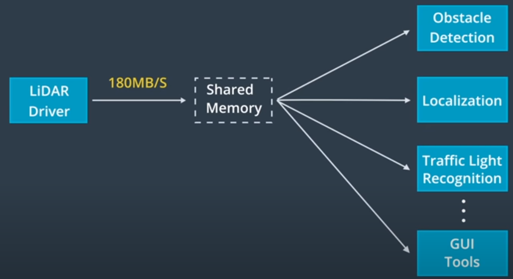
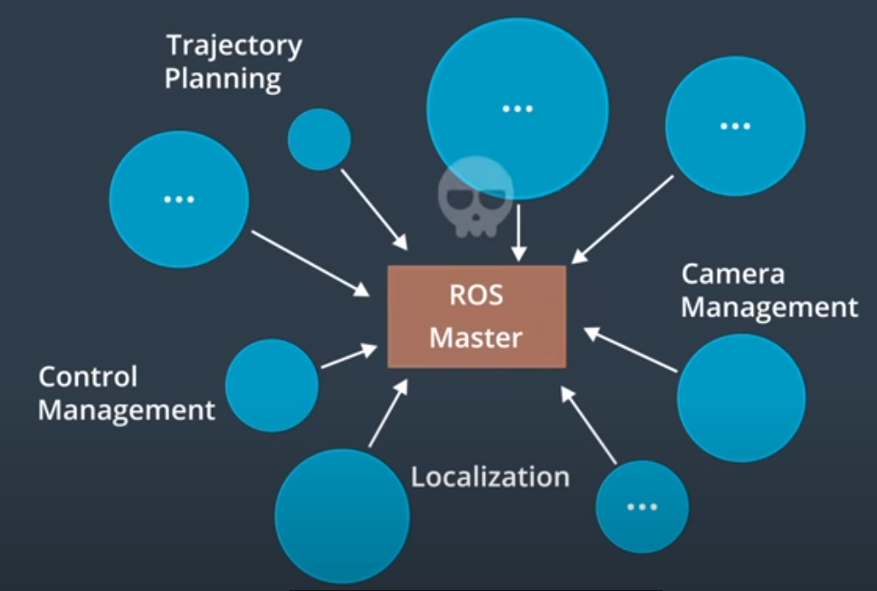
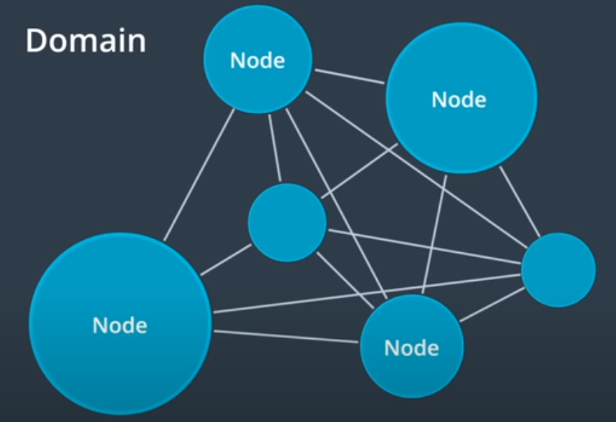

This is my note for lesson 1 of MOOC course: Self-Driving Fundamentals - Featuring Apollo. Content: Identify the key parts of self-driving cars. The Apollo team and architecture.

## Human vs Self-driving Car

| Human                       | Self-Driving Car         | 
|-----------------------------|--------------------------|
| High traffic accident rate  | More reliable driving    |  
| Learn to drive from scratch | Learnable driving system |   
| Parking trouble             | No parking trouble       |  

## Six levels of self-driving car

- **Level 0: Base level - No autonomous task**

- **Level 1: Driver assistance**
    + Driver Fully Engaged

- **Level 2: Partial Automation**
    + Automatic Cruise Control
    + Automatic Lane Keeping

- **Level 3: Conditional Automation**
    + Human Take Over Whenever Necessary

- **Level 4: No Human Interference**
    + Without Steering Wheel, Throttle or Brake
    + Restricted in Geofence

- **Level 5: Full Automation**

## Apollo platform

### 1. Hardware

- The Controller Area Network (CAN) cars is how the computer system connects to the car internal network to send signals for acceleration, braking and steering.

- The Global Positioning System (GPS) receives signals from satellites, circling the earth. These signal help to determine our location.

- The Inertial Measurement Unit (IMU) measure the vehicle movement and location by tracking the position, speed, acceleration and other factors.

- LiDAR is an array of pulse layers. The LiDAR of Apollo can scan 360 degrees around the vehicle. The reflection of these lazer beams builds the point cloud that our software can use to understand the environment.

- Cameras can be used to capture environment. For example because cameras can perceive color, they can be use to detect and understanding traffic lights. 

- Radar is also used for detecting obstacle. However, it's difficult to understand what kind of obstacle that radar has detected. Advantages: it's economical, it works in all weather and lighting condition.

### 2. Open Software Stack

**Sublayers:**
- Real-time operating system (RTOS)
- Runtime framework
- Application modules

#### Real-time operating system (RTOS)

Apollo RTOS is a combination of **Ubuntu linux** and the **Apollo kernel**.
- Ubuntu is popular but not a RTOS.
- Ubuntu + Apollo kernel -> RTOS.

#### Runtime framework: Customized ROS (Robot Operation System)

To adapt ROS for self-driving cars, the Apollo teams has:
- Improve functionality
- Improve performance for **shared memory**, **decentralization** and **data comparability**

**Apollo uses shared memory**

**Apollo decentralize ROS architecture**

- The original architecture of ROS:

- Decentralized architecture of ROS:

**Apollo used Protobuf instead of native ROS Message for data comparability between different versions of the system**

### 3 Apollo Cloud Service

- HD Map
- Simulation
- Data platform
- Security
- OTA

## Apollo Github

Link to Github repo: <https://github.com/ApolloAuto/apollo>.