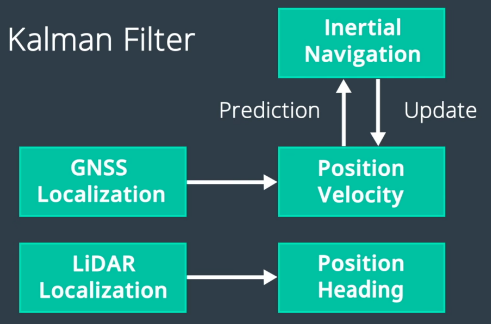

This is my note for lesson 3 of MOOC course: Self-Driving Fundamentals - Featuring Apollo. Content: How the vehicle localizes itself with a single-digit-centimeter-level accuracy.

## Localization methods in Apollo

- The RTK (Real Time Kinematic) based method which incorporates GPS and IMU (Inertial Measurement Unit) information.
- The multi-sensor fusion method which incorporates GPS, IMU, and LiDAR information.

## Inertial navigation

### Global Navigation Satellite System (GNSS)

Global Navigation Satellite System (GNSS) refers to a constellation of satellites providing signals from space that transmit positioning and timing data to GNSS receivers. The receivers then use this data to determine location. Global Positioning System (GPS) is a kind of GNSS.

**Properties:**
- Accurate with RTK
- Poor performance in urban area and canyons
- Low frequency update (~10Hz) ➝ Too slow for realtime positioning on SDC.

### Inertial Measurement Unit (IMU)

**On Wikipedia:**
An inertial measurement unit (IMU) is an electronic device that measures and reports a body's specific force, angular rate, and sometimes the orientation of the body, using a combination of accelerometers, gyroscopes, and sometimes magnetometers.

**Components of IMU:**
- Accelerometer: measures velocity and acceleration
- Gyroscope: measures rotation and rotational rate
- Magnetometer: establishes cardinal direction (directional heading)

**Disadvantage:** The IMU's motion error increase with time.

### GPS + IMU

We can combine **GPS + IMU** to localize the car. On one hand, **IMU compensates for the low update frequency of GPS**. On the other hand, **GPS corrects the IMU's motion errors**.

## LiDAR Localization

With LiDAR, we can localize a car by means of point cloud matching. This method continuously matches the detected data from LiDAR sensors with the preexisting HD map. ➝ **Require constantly updated HD map** ➝ **Very difficult.**

## Visual localization

**Can we use images from cameras to localize the car?**

Yes, but using only camera is hard. We often combine images with other sensor signals.

**Particle Filter:** We use particles or points on the map to estimate our most likely location.

## Apollo Localization

Apollo localization using input from multiple sources and use Kalman Filter for sensor fusion.

## Kidnapped Vehicle

TODO: Try Kidnapped Vehicle Project.

