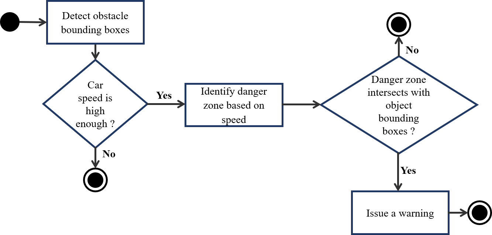
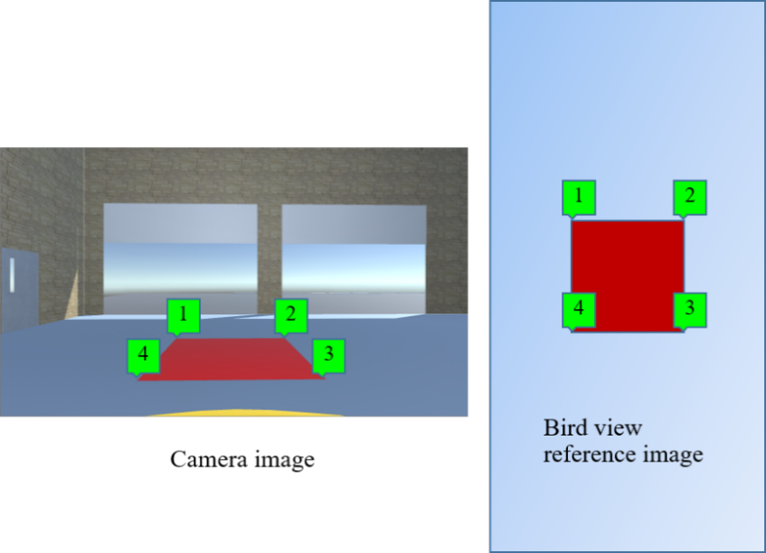
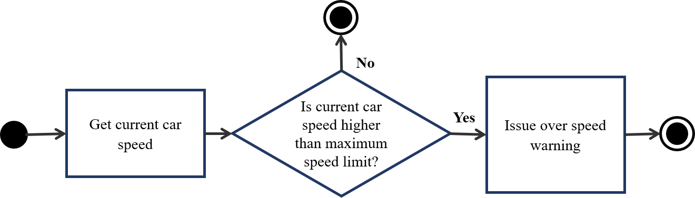
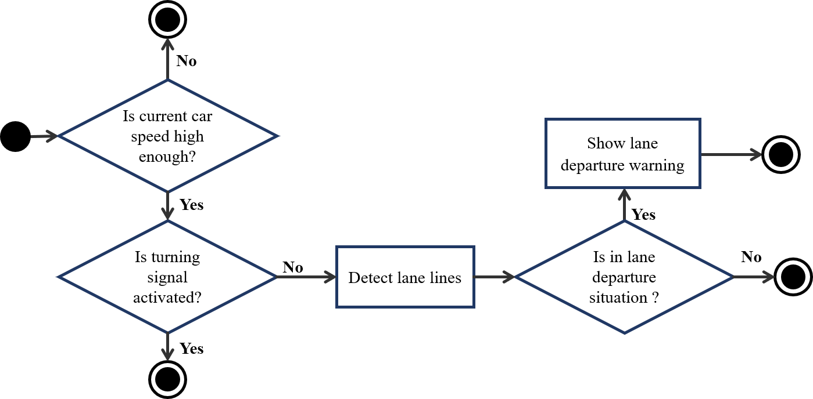
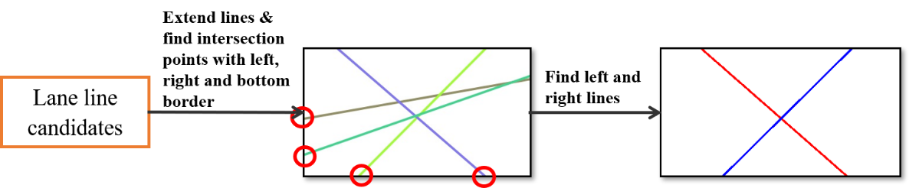
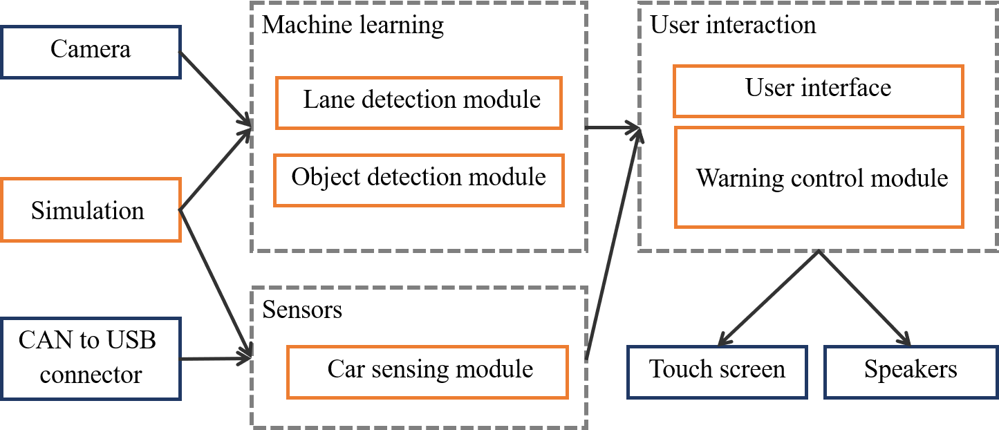
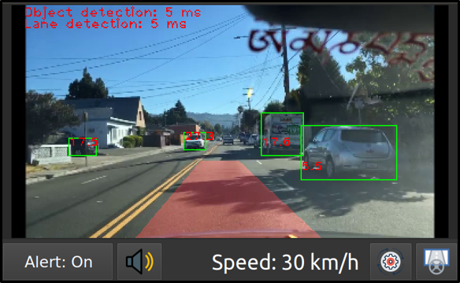

Recently, I have built a prototype of an advanced driver-assistance system (ADAS) using a [Jetson Nano computer](/posts/2020-04-02-thiet-lap-ban-dau-cho-jetson-nano/). In this project, I have successfully deployed **3 deep neural networks**  and some **computer vision algorithms** on a [super cheap hardware of Jetson Nano](https://www.nvidia.com/en-us/autonomous-machines/jetson-store/). I decided to write this post series to share about how this system was designed and implemented. [The first post](/posts/adas-jetson-nano-intro-and-hardware/) is an introduction and the hardware design of my system. Today post will talk about the software design.

The software system provides three main functions: **(i) forward collision warning with forward vehicles and pedestrians, (ii) lane analysis and lane departure warning, (iii) sign detection for maximum speed limit signs and over-speed warning**. These functions will be described in next 3 sections.

## I. Forward collision warning

Above figure (Figure 3) shows the mechanism of forward collision warning. After obstacle detection step, the system has the bounding boxes of obstacles (the green boxes in Figure 2), including forward vehicles and pedestrians. Warning is only issued when the car speed is high enough. The collision warning is done by identifying the danger zone in front of the vehicle and determining whether the bounding box of the any object meets the danger zone. In Figure 2, the determined danger zone is the red area in front of the camera.

### Danger zone identification

In order to identify danger zone in image space, the system has to determine the danger zone in meters on the road, and then convert it to a corresponding area on the image. In this system, I use a bird view image as an immediate between the camera image and the real-world distances (Figure 4). After calculating the danger zone in meters in real-world space, the system calculates a corresponding area on the bird-view image using a meter-to-pixel ratio. This area is then transformed to a danger zone on the camera image using a perspective transform matrix. The meter-to-pixel ratio and the perspective transform matrix should be setup in camera calibration process.

**Camera calibration**

Transformation parameters include the meter-to-pixel mapping from the real-world distances to the bird view image space and the perspective transform matrices between the bird view image to the camera image. In order to calculate these parameters, I use following solution: put a red carpet in the front of the car, measure distances $W1$, $W2$, $L1$, $L2$ as shown in Figure 5. The images in Figure 5 were created using [Unity](https://unity.com/) framework.

By selecting 4 points on the image obtained from dash camera, and establishing corresponding points in the bird view reference image (Figure 6 - below), the system calculates perspective transform matrix ($H$) and inverse perspective transform matrix ($H’$) between the image space and the bird view space. The calculation of the correlation ratio between $L2$, $W2$ and corresponding distances in bird view space helps determine that each pixel in bird view image corresponds to how many meters in the real world. After this calibration, we save all measured parameters as new settings for camera.

**Dangerous zone estimation**

This system depends on the car width $W1$ and the danger distance  to estimate the danger zone in front of vehicle. We assume that $S$ is the distance that the vehicle can move to in the next $t = 1.5$ seconds. This distance is calculated using car speed $v$ (m/s) by the following equation:

$$
S = v.t
$$

The area of the danger zone is $S \times W1$.

After calculating this danger zone, the system establishes a danger zone in corresponding bird view reference image and convert this area to camera image space using perspective transform matrix ($H$).

**Estimate distances to objects ahead**

Although our system determines the dangerous situation by finding the intersection between object bounding boxes and danger zone in the image space, it also estimates the distance to forward vehicle as an additional helpful information for driver. This estimation process is described in Figure 8. Assume we have an object bounding box from object detection module. We transform this box to bird view space using inverse perspective transform matrix $H’$. After finding the bottom point of this bounding box, we use the pixel-to-meters ratio calculated from camera calibration to find the distance to object in meters. This distance is then shown to driver as a useful information.

## II. Traffic sign detection and over-speed warning

Figure 9 shows the traffic sign detection flow. First, the system needs to detect traffic signs from dash camera image. When a new traffic sign comes in, if it is an end-of-speed-warning sign, the system removes all over-speed warnings, otherwise, if it is a maximum speed limit sign, it shows this sign to the screen and remember the maximum speed level in 30 minutes. The traffic sign type is also read aloud by the system through the speakers.  At the same time, the system continuously checks for over-speed situation and issue warning if needed (Figure 10). This process constantly gets the car speed in real time and compare received speed with the maximum speed limit and warns drivers when they go over speed.

## III. Lane departure warning

Figure 11 describes the flow of lane departure warning. Lane analysis is only activated when car speed is high enough (higher than 30km/h) and turn signal is off. When these two conditions are satisfied, the system detect lane lines from dash camera image and analyze these lane lines. If the system recognizes lane departure situation, it issues a lane departure warning immediately by showing an alert to screen and playing alert sound through speakers.

Lane line detection can be done using a semantic segmentation neural network and computer vision algorithm. The result of this process if lane line candidates. From lane line candidates found in lane line detection, we extend lines and find intersection points of these lines with left, right and bottom borders of the image (Figure 12). We consider the line corresponding to the left-most intersection point on the right as the right lane line and the line corresponding to the right-most intersection point on the left as the left lane line. The intersection points of right and left lane line are compared with the center point of bottom edge of the image to determine the lane departure situation. 

Assume the intersection of the left lane line and the bottom edge of the image is left point A, the intersection of the right lane line and the bottom edge of the image is right point B, and the middle point of the bottom edge is C – center point (Figure 13). The distances from A, B to C is normalized into range from 0 to 1. A lane departure situation is determined when one of these conditions happens: (1) AC < d1 and BC > d2 or (2) AC > d2 and BC < d1. In this project, I choose d1 = 0.3 and d2 = 0.5. 

## III. Software implementation

### Software packages

There are six main modules in this system, which are: object detection module, lane detection module, sensing module, warning control module, user interface module and simulation. Figure 14 shows the design of software modules and the interactions with hardware part. In a production system like MobileEye 630, the system takes images from camera and car states (such as speed, turn signal) through CAN bus. However, in development stage of this project, I use Simulation module to simulate data from camera and CAN bus.

Image data from camera or simulation is passed through a machine learning block. There are two main modules here: lane detection module and object detection module, which are backed by machine learning algorithms. Lane detection module takes responsibility for lane line and lane departure detection, while object detection module detects forward vehicles, pedestrians, and traffic signs. In these modules, deep neural networks and computer vision algorithms are used to analyze images from dash camera. In order to give correct warnings, the system has to use other data from car such as speed and turn signal. 

After processing all image and sensor data, if the system recognizes a dangerous situation, user interface and warning control module are responsible for issue warnings. These two modules are wrapped in user interaction block and output results directly to a touch screen and speakers.

### User interface

The user interface of this project is designed and optimized for touch screen. Following are some main screens of the system.

### Demonstration

To sum up, this post talks about the software design of my advanced-driver assistance system on Jetson Nano. The next posts will be about the implementation of deep learning models, the conversion process to TensorRT engine, and how to optimize the system to run smoothly on Jetson Nano. If you want the video demonstation of the system, please visit [the first post of this series](/posts/adas-jetson-nano-intro-and-hardware/). All comments are welcome. Thank you!

