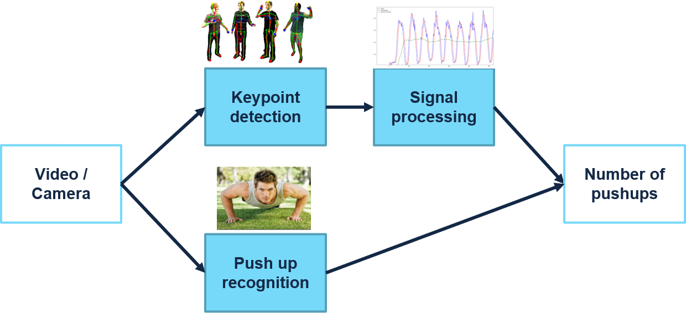
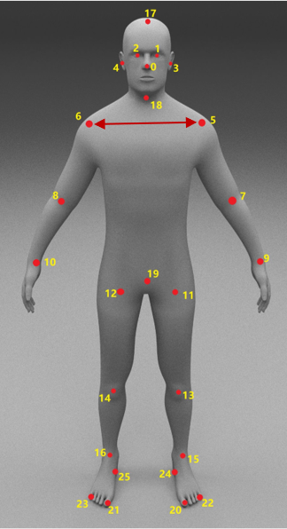
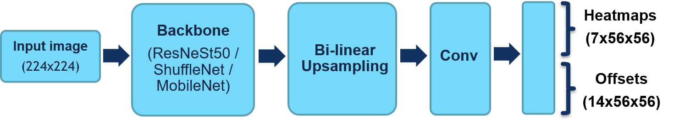
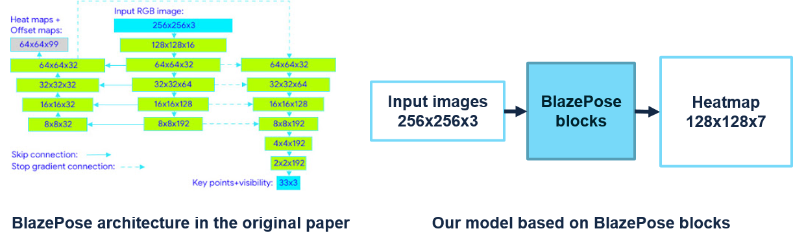

Since 2019, the raging COVID-19 epidemic has claimed the lives of many people and forced many countries to take measures to blockade and isolate. Exercising at home is becoming a new way to improve people's health and protect them from the Corona virus. Many people responded to the 30-day push-ups challenge with the hashtag #pushupchallenge on social networks as a way to encourage each other to take some physical activities. [My team](https://vnopenai.org/our-team/) has designed and built a desktop app that can analyze and count the number of pushups. With this intelligence feature and an attractive user interface, our application is expected to make fitness more enjoyable. This post will share with you our design and implementation of this idea.

First, I want to share with you our interesting demonstration before going into details.



## 1. System Analysis and Design

### Sensor-based pushup counter

The sensor-based implementations of a pushup counter require the user to touch or come close to a proximity sensor. You can find some patents, DIY projects or some apps using this approach below. This kind of implementation depends on some specific sensors, or hardware mechanisms to run. We think that using a touch button or proximity sensor for counting pushups is not a convenient way for the user. This approach is also hard to be extended to use with other workout activities.

**Examples of sensor-based method:**

- Push up device: <https://patents.google.com/patent/US8998783B2/en>.
- Arduino Pushup Counter: <https://create.arduino.cc/projecthub/mixpose/pushup-counter-e3ed69>.
- Push Up Counter App - Google Play Store: <https://play.google.com/store/apps/details?id=michaelbosch.com.pushupscounter&hl=en_US&gl=US>.

### Computer vision approaches

Computer vision approaches are expected to be a more interesting and more general way to sensor-based methods. Using a camera, we can analyze different kinds of workout activities, and also deploy other ideas like workout pose correction. Let's look into some methods.

#### Different approaches for pushup counting

**General counters:** Google RepNet ([link](https://sites.google.com/view/repnet), [paper](https://arxiv.org/pdf/2006.15418.pdf)) is a SOTA method of general counter, where we can feed a video stream in and receive the counting. This approach can be used to count multiple activities with the network. However, this kind of network works not very well when the period of the activity is unstable. This architecture also requires a huge amount of computation, which is not suitable for running in realtime on weak desktop PCs or mobile devices.

**Other time series methods on video:** We did some experiments with deep neural architectures to analyze video stream (3D-CNN + Linear, CNN + LSTM) and trigger a count whenever a pushup is finished. However, these architectures also met performance issues and could not capture the activity period well.

**Image processing + Signal processing:** [This post](https://collinalexbell.medium.com/building-a-pushup-counter-with-opencv-clojure-bcee2c4720a3) talks about a naive method to analyze the positions of moving pixels using signal processing and count the peaks for pushups. However, we suppose that this method suffers from wrong counting when the user doesn't do pushup. The counting result is also affected by environmental factors such as other moving objects or changing light conditions. 

**Optical flow:** [This repository](https://github.com/NetoPedro/Deep-Learning-Push-Up-Counter) brought us the idea of using optical flow. They use a neural network to classify dense optical flow frames into "Moving Up", "Moving Down" or "Not Moving". However, we suppose that the direction of the movement can be regressed only by using the main angle of the optical flow vectors, so it's unnecessary to use the neural network here. We also tried to analyze the average angle of the optical flow vector with signal processing and obtained an optimistic result. Still, we don't want to use this method because the magnitude of optical flow vectors depends a lot on the speed of movement and this may cause wrong counts.

#### Our approach

In our design, we combine keypoint detection and signal processing to count the pushups. In order to eliminate wrong counting when the users do other activities, we use a pushup recognition network to recognize pushup activity from the video stream. Using keypoint detection opens a new development idea: analyze pushup pose and give warnings when users do pushups in a wrong way.

## 2. Human keypoint detection

Human keypoint detection (or human pose estimation) is defined as the problem of localization of human joints (also known as keypoints - elbows, wrists, etc) in images or videos.
### Datasets

In this project, we only detect 4 keypoints: head, 2 shoulders, 2 hands, and 2 wrists. Our dataset was built up with 11503 images from [MPII Human Pose Dataset](http://human-pose.mpi-inf.mpg.de/) and 11039 images from crawled Facebook videos. The distribution of our dataset is described below.

### Metric

In order to measure the quality of the models, we define Percentage of Correct Keypoints shoulder (PCKs) metric. A detected joint is considered correct if the distance between the predicted and the true joint is within a certain threshold. The threshold here is chosen as 0.25 times of the distance between 2 wrists (or the distance between point 5 and point 6 in the image).

### Model architecture

We propose a heatmap-based architecture to detect keypoints. In this architecture, we did some experiments with 3 backbones: ResNeSt50, ShuffleNet, and MobileNet). You can find our experimental code [here](https://github.com/VNOpenAI/pushup-keypoint-detection).

Based on [BlazePose](https://arxiv.org/abs/2006.10204), a lightweight convolutional neural network architecture for human pose estimation, we also design a lightweight heatmap-based architecture by using some building blocks of this network. Our implementation can be found [here](https://github.com/VNOpenAI/tf-blazepose).

**Our results:**

| Model                  | PCKs  | MAE   | # of Params |
|------------------------|-------|-------|-------------|
| ResNeSt backbone       | 0.818 | 0.028 | 10,563,989  |
| ShuffleNet backbone    | 0.766 | 0.032 | 1,557,443   |
| MobileNet backbone     | 0.786 | 0.029 | 1,910,437   |
| BlazePose - Heatmap branch | 0.760 | 0.032 | 885,559 |

## 3. Use signal processing to count

In the first implementation, we pick the head keypoint and design an algorithm to count pushups using the position of this point. The position of the head point is considered as a time-series signal. In order to count pushups, we apply 3 steps:

- **Step 1:** Filter the signal using a low-pass filter.
- **Step 2:** Calculate the adaptive mean and standard deviation of the signal over time. At time point $t$, the signal value is denoted as $s(t)$. The sequence $s(t-1), s(t-2), ..., s(t-n)$ has mean $\mu_{s(t-1)}$ and standard deviation $\sigma_{s(t-1)}$, with $n$ is the length of sampling window.
- **Step 3:** Calculate current frame label value:

$$
\text { label }=\left\{\begin{array}{cc}
1 & \text { if } s(t)>\mu_{s(t-1)}+h * \sigma_{s(t-1)} \\
0 & \text { otherwise }
\end{array}\right.
$$

- 1 is corresponding to the high position of head points, 0 is corresponding to other positions.
- $h$ is a configurable parameter.

We count the number of alters between two labels for the number of pushups.

## 4. Pushup recognition

The signal processing method can cause redundant counts when the user is not pushing up. We use another classification network based on MobileNetV2 to recognize when the user is pushing up to eliminate wrong counts. This network receives the image as input and answers the question "is the user pushing up?". Although we haven't had much time to optimize this network, it worked.

## 5. Desktop app implementation

Our project is for educational purposes only so that we design a simple user interface with OpenCV. Below is the main screen of our application. Click the image to open Youtube video.

## 6. Conclusion

We had to finish our pushup counter in a limited time (~2 weeks). Therefore, we believe that it's certainly not the best result of our approach. It can be improved a lot more, for example, bettering counting result with more keypoints or leveraging the keypoints to correct wrong pushup poses. You can also use our code to train models and build the counter for other workout activities.

We published our application source code at <https://github.com/VNOpenAI/pushup-counter-app>.
## Other resources

- Our team: <https://vnopenai.org/our-team/>.
- RepNet <https://arxiv.org/pdf/2006.15418.pdf>.
- Workout Type Recognition and Repetition Counting with CNNs from 3D Acceleration Sensed on the Chest
<https://ambientintelligence.aalto.fi/team_old/findling/pdfs/publications/Skawinski_19_WorkoutTypeRecognition.pdf>.
- Recognition and Repetition Counting for Complex Physical Exercises with Deep Learning <https://www.ncbi.nlm.nih.gov/pmc/articles/PMC6387025/>.

